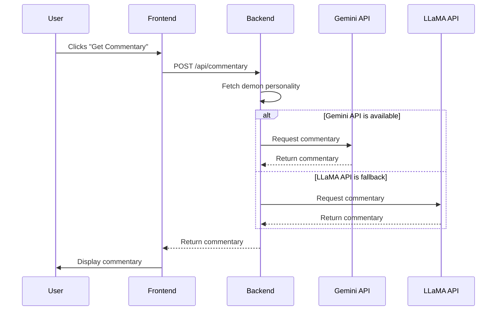

# Architectural Plan: AI-Powered Demonic Commentary

This document outlines the architecture for a new feature that provides AI-powered commentary on user's writing, with each of the 72 demons from the Ars Goetia offering a unique perspective.

## 1. Backend File Structure

To keep the backend and frontend code separate and organized, we will create a new `backend` directory. This directory will contain all the server-side logic for the new feature.

```
/backend
|-- /config
|   |-- keys.js
|-- /routes
|   |-- api
|       |-- commentary.js
|-- /services
|   |-- gemini.js
|   |-- llama.js
|-- /utils
|   |-- errorHandler.js
|-- server.js
```

**File Descriptions:**

*   **`server.js`**: The main entry point for the Node.js server. It will handle server configuration, middleware, and API routing.
*   **`/config/keys.js`**: This file will manage the API keys for the Gemini and LLaMA services. It will fetch the keys from environment variables to keep them secure.
*   **`/routes/api/commentary.js`**: This file will define the API endpoint for generating commentary. It will handle incoming requests, validate the payload, and call the appropriate service to generate the commentary.
*   **`/services/gemini.js`**: This file will contain the logic for interacting with the Gemini API. It will be responsible for creating the prompt, sending the request, and handling the response.
*   **`/services/llama.js`**: This file will contain the logic for interacting with the LLaMA API. It will serve as a fallback if the Gemini API is unavailable.
*   **`/utils/errorHandler.js`**: A utility file for handling errors throughout the backend.

## 2. Data Flow Diagram

The following diagram illustrates how a request for commentary is processed, from the user's initial action to the final display of the AI-generated text.



## 3. API Design

A new endpoint will be created to handle requests for commentary.

**Endpoint:** `POST /api/commentary`

**Request Body:**

```json
{
  "demonId": 1,
  "text": "The user's writing to be analyzed."
}
```

**Success Response (200 OK):**

```json
{
  "commentary": "The AI-generated commentary from the demon."
}
```

**Error Response (400 Bad Request):**

```json
{
  "error": "Invalid request body. demonId and text are required."
}
```

**Error Response (500 Internal Server Error):**

```json
{
  "error": "An error occurred while generating commentary."
}
```

## 4. API Key Management

To ensure the security of the Gemini and LLaMA API keys, we will use environment variables. This approach avoids hardcoding keys into the source code and keeps them safe from being exposed in the version control system.

A `.env` file will be created in the `backend` directory to store the keys during local development. This file will be added to the `.gitignore` file to prevent it from being committed to the repository.

**`.env` file:**

```
GEMINI_API_KEY=your_gemini_api_key
LLAMA_API_KEY=your_llama_api_key
```

The `config/keys.js` file will be responsible for reading these keys from the environment variables.

**`backend/config/keys.js`:**

```javascript
module.exports = {
  gemini: process.env.GEMINI_API_KEY,
  llama: process.env.LLAMA_API_KEY,
};
```

## 5. Frontend Integration

To integrate the new commentary feature into the frontend, we will make the following changes:

*   **`DemonSelector.jsx`**: A "Get Commentary" button will be added next to the demon selection dropdown. When clicked, this button will trigger a function to fetch the commentary from the backend.
*   **`Editor.jsx`**: A new component will be created to display the commentary. This component will be positioned next to the main text editor, allowing the user to see the commentary as they write.
*   **`AppContext.jsx`**: The `AppContext` will be updated to manage the state of the commentary, including the loading state and the commentary text itself.

### New Component: `CommentaryDisplay.jsx`

This new component will be responsible for displaying the AI-generated commentary. It will show a loading indicator while the commentary is being fetched and will display the commentary text once it's available.

### User Interaction Flow

1.  The user selects a demon from the `DemonSelector`.
2.  The user clicks the "Get Commentary" button.
3.  The frontend sends a request to the backend with the selected demon's ID and the current text from the editor.
4.  While the request is in progress, a loading indicator is displayed in the `CommentaryDisplay` component.
5.  When the backend returns the commentary, it is displayed in the `CommentaryDisplay` component.