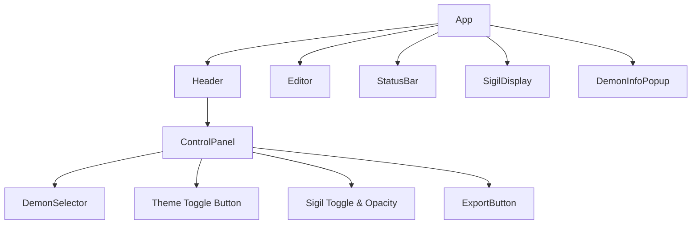

# Architectural Plan: Goetic Word Processor Refactoring

## 1. Introduction

This document outlines a comprehensive architectural plan to refactor the `GoeticWordProcessor` application. The current implementation is a single, large React component. The goal of this refactoring is to improve modularity, maintainability, scalability, and overall code quality by breaking it down into smaller components, separating data and logic, and adopting more robust patterns for styling and state management.

## 2. Proposed File Structure

A more organized file structure will make the codebase easier to navigate and manage.

```
/src
|-- /components
|   |-- /ui
|   |   |-- Button.jsx
|   |   |-- Select.jsx
|   |   |-- RangeSlider.jsx
|   |-- ControlPanel.jsx
|   |-- DemonInfoPopup.jsx
|   |-- DemonSelector.jsx
|   |-- Editor.jsx
|   |-- Header.jsx
|   |-- SigilDisplay.jsx
|   |-- StatusBar.jsx
|-- /constants
|   |-- demons.js
|   |-- sigils.js
|-- /contexts
|   |-- AppContext.jsx
|-- /hooks
|   |-- useAutoSave.js
|   |-- useWordCount.js
|-- /styles
|   |-- global.css
|   |-- theme.js
|   |-- components.module.css
|-- /utils
|   |-- fileExporter.js
|   |-- gematria.js
|-- App.jsx
|-- index.js
/public
|-- /sigils
|   |-- 1.svg
|   |-- 2.svg
|   |-- ...
```

## 3. Component Structure

The main `GoeticWordProcessor` component will be broken down into smaller, single-responsibility components.



### Component Breakdown:

*   **`App.jsx` (Container):** The main application container. It will manage global state via `AppContext` and compose the other components.
*   **`Header.jsx`:** A simple component to hold the top part of the UI, including the `ControlPanel`.
*   **`ControlPanel.jsx`:** Manages all user controls, such as demon selection, theme, and sigil visibility.
*   **`DemonSelector.jsx`:** A dedicated component for the demon dropdown and the randomizer button.
*   **`Editor.jsx`:** The main text area for user input. It will be a controlled component, getting its value and `onChange` handler from the `AppContext`.
*   **`StatusBar.jsx`:** The bottom bar displaying word count, Gematria, and save status.
*   **`SigilDisplay.jsx`:** Responsible for rendering the background sigil. It will get the selected demon and visibility status from context.
*   **`DemonInfoPopup.jsx`:** The popup that appears to show information about the selected demon.

## 4. Data Management

The hardcoded `demons` and `sigilPaths` data will be externalized for better scalability and organization.

*   **Demon Data:** The `demons` array will be moved to `src/constants/demons.js` and exported as a constant. In the future, this could be changed to a function that fetches data from a JSON file or an API without changing the components that use it.
*   **Sigil Data:** The `sigilPaths` object will be deprecated. Instead, we will use a convention-based approach. Each demon's sigil will be an individual SVG file named after the demon's number (e.g., `1.svg`, `2.svg`) and placed in the `public/sigils/` directory. This makes it easy to add or change sigils without touching the code. The `SigilDisplay` component will construct the path to the image dynamically.

## 5. Sigil Handling

The current method of using SVG paths inside the component is not scalable.

*   **Storage:** All sigils will be stored as individual SVG files in `public/sigils/`. This allows the browser to cache them and keeps them separate from the application logic.
*   **Access & Rendering:** The `SigilDisplay` component will receive the `selectedDemon` object. It will then construct the image URL like `/sigils/${selectedDemon.number}.svg` and render it within an `` tag or as a `background-image`. This is much more efficient and easier to maintain.

## 6. Styling

We will move away from inline styles and template literals with TailwindCSS classes towards a more structured approach.

*   **CSS Modules:** We will use CSS Modules for component-level styling. A file like `components.module.css` will contain styles for specific components, preventing class name collisions.
*   **Global Styles:** A `src/styles/global.css` file will define base styles, fonts, and CSS variables.
*   **Theme Management:** A `src/styles/theme.js` file will export theme objects for light and dark modes.
    ```javascript
    // src/styles/theme.js
    export const lightTheme = {
      background: '#ffffff',
      text: '#000000',
      // ...
    };

    export const darkTheme = {
      background: '#000000',
      text: '#ffffff',
      // ...
    };
    ```
    The `AppContext` will manage the current theme, and a top-level class on the `<body>` or root `<div>` will toggle the theme variables.

## 7. State Management & Code Quality

*   **Global State with Context:** To avoid prop drilling, we will introduce a global `AppContext` (`src/contexts/AppContext.jsx`). This context will provide:
    *   `selectedDemon` and `setSelectedDemon`
    *   `text` and `setText`
    *   `darkMode` and `toggleDarkMode`
    *   Other shared states like `showSigil`, `sigilOpacity`, etc.
*   **Custom Hooks:** The logic for auto-saving and word counting will be extracted into custom hooks:
    *   `useAutoSave(text, demonNumber)`: Handles the `localStorage` logic.
    *   `useWordCount(text)`: Returns the current word count.
    This will significantly clean up the main `App` component.
*   **Utilities:** Helper functions that don't depend on component state will be moved to the `src/utils/` directory.
    *   `fileExporter.js`: For the text export functionality.
    *   `gematria.js`: For the Gematria calculation.
*   **Accessibility (A11y):**
    *   Add `aria-label` attributes to all icon buttons for screen readers.
    *   Ensure proper focus management, especially for the popup.
    *   Use semantic HTML elements where appropriate.

## 8. Conclusion

This architectural plan transforms the `GoeticWordProcessor` from a single-file application into a structured, scalable, and maintainable React project. By separating concerns, we create a codebase that is easier to understand, test, and extend in the future.